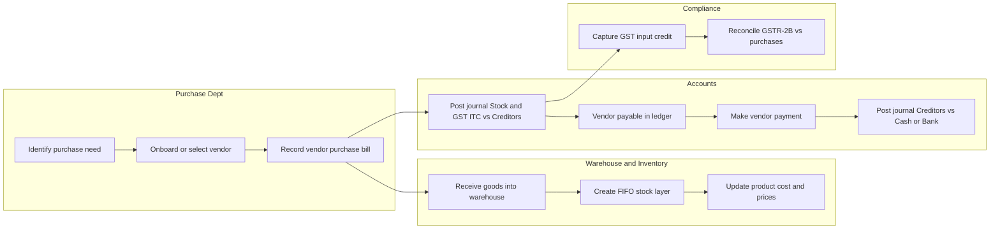
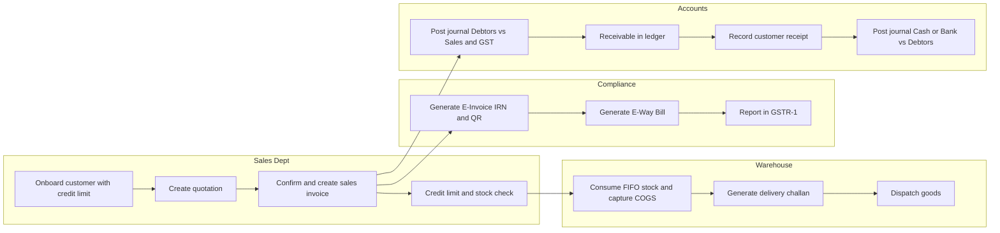
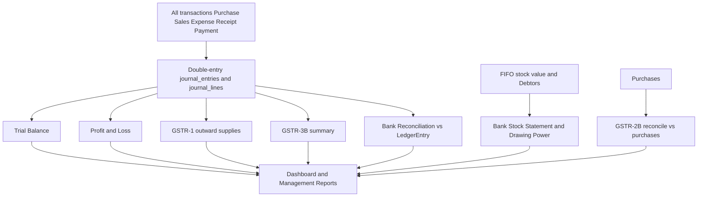

# Wholesale ERP — Business Process Flow Diagrams

End-to-end **business processes** that flow *across* modules, organised by department/role
(swimlanes). Unlike the per-module technical flowcharts in
[MODULE_WORKFLOWS.md](MODULE_WORKFLOWS.md), these show how a single business transaction travels
through Purchase, Warehouse, Sales, Accounts and Compliance.

Diagrams use [Mermaid](https://mermaid.js.org/) and render on GitHub / VS Code. For a rendered
picture view, open [business-process-flows.html](business-process-flows.html) in a browser.

---

## 1. ERP Business Process Landscape

The big picture: master data feeds the core operating processes, which post into finance &
compliance, which surface in management reporting.

```mermaid
flowchart LR
    subgraph MD[Master Data Setup]
        direction TB
        MD1[Company and Tax Settings]
        MD2[Products and Pricing]
        MD3[Vendors and Customers]
        MD4[Users and Roles]
    end
    subgraph OP[Core Operating Processes]
        direction TB
        OP1[Procure to Pay]
        OP2[Inventory and Warehouse]
        OP3[Order to Cash]
    end
    subgraph FC[Finance and Compliance]
        direction TB
        FC1[Record to Report]
        FC2[GST Compliance]
        FC3[Banking and Treasury]
    end
    subgraph MG[Management]
        direction TB
        MG1[Dashboard and Reports]
    end
    MD --> OP
    OP --> FC
    FC --> MG
```

---

## 2. Procure-to-Pay (P2P)

A vendor purchase from need to payment, crossing four departments.

---

## 3. Order-to-Cash (O2C)

A customer sale from enquiry to collection, with statutory e-invoice / e-way steps.

---

## 4. Record-to-Report & GST Compliance

Every posted transaction rolls up into the books, statutory returns, bank reconciliation and
management reports.

