# Wholesale ERP — Module Workflows

High-level workflow diagrams for each functional module, grounded in the actual
service/endpoint code (not generic templates). Diagrams use [Mermaid](https://mermaid.js.org/)
and render automatically on GitHub and in VS Code (Markdown preview / Mermaid extension).

**Stack:** FastAPI + MariaDB backend, React 18 (Vite) frontend. Indian GST context throughout
(GSTIN, state codes, HSN, INR, April-start FY).

---

## How the modules interconnect

The transactional modules feed two shared backbones — **FIFO stock** (`StockEntry` /
`WarehouseStock`) and **double-entry accounting** (`journal_entries` / `journal_lines`) — which
the GST, Banking, and Reports modules then read.

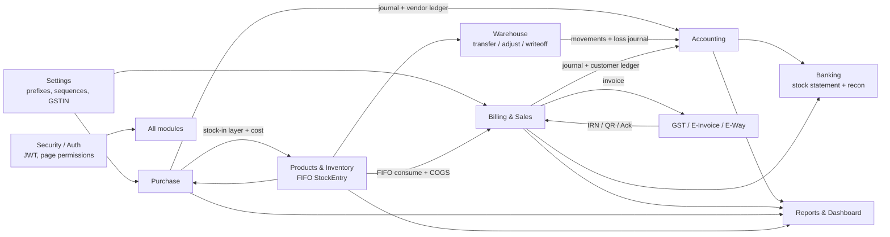

---

## 1. Security, Users & Auth

**What it does:** JWT login with account-lockout after repeated failures, issues access +
refresh tokens, registers an active session and login history. Admins manage the user lifecycle
(create / update / reset-password / suspend / unlock / force-logout) behind super-admin role
gates; every privileged action writes to the activity log, and a suspicious-activity scan flags
repeated failed logins and bulk exports.

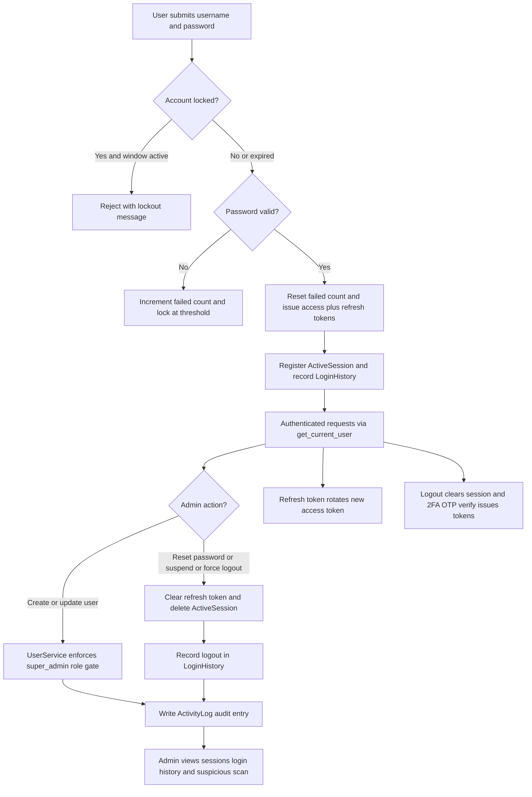

**Triggers / feeds:** Self-contained auth/audit module — no stock, journal, or GST side effects.
Feeds `page_permissions` and `warehouse_id` consumed by every other module for access control;
`ActivityLog` records exports flagged from Reports.

---

## 2. Settings

**What it does:** Admin-managed configuration hub. Stores a single `CompanySettings` record
(identity, GSTIN/state, address, bank/UPI, invoice prefixes, e-way threshold, bank-stock margin,
FY start), lets admins edit invoice numbering sequences, upload a logo, and manage per-user
page-level permissions. Exposes read-only GST-rate and Indian-state master lists. Reads are open
to any authenticated user; all writes require admin.

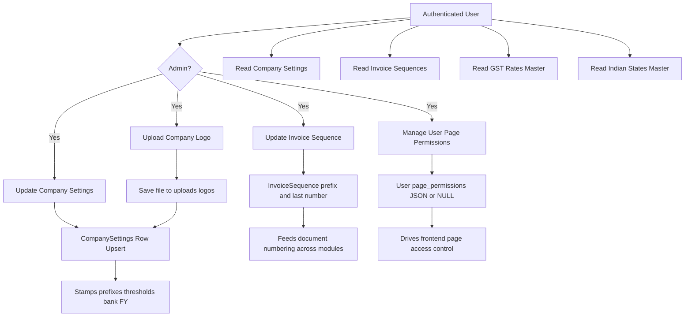

**Triggers / feeds:** Config provider — no stock/journal/GST calls. Invoice prefixes and
sequences feed document numbering in Billing/Purchase/GST; `eway_threshold`/`state_code`/GSTIN
feed GST and E-Way logic; `bank_stock_margin` feeds bank stock valuation; per-user
`page_permissions` drive Security/UI access control.

---

## 3. Products & Inventory

**What it does:** Manages category and product master data (HSN/GST setup, category-prefixed part
codes), enforces a `floor ≤ b2b ≤ b2c ≤ mrp` price ordering with a cost-floor guard, and runs a
versioned multi-type price-history engine supporting immediate or future-scheduled prices,
below-cost/low-margin alerts, and bulk updates. Stock is tracked through FIFO `StockEntry` layers
whose `remaining_qty` is consumed in batch-date order alongside a `WarehouseStock` running total —
feeding ageing, cost-trend, and FIFO-vs-latest valuation reports.

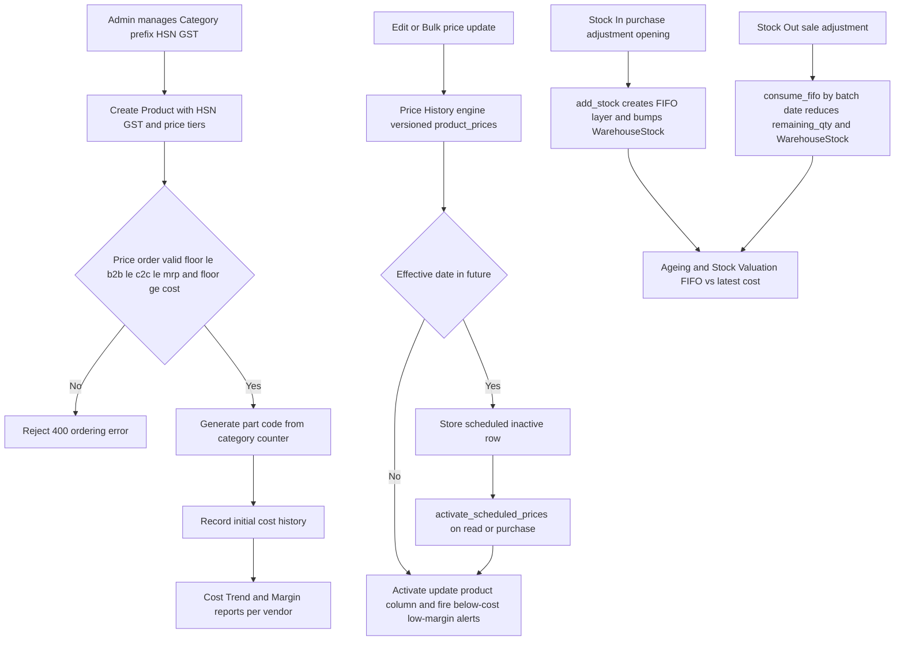

**Triggers / feeds:** Purchase calls `add_stock`/`record_cost` to create FIFO layers and triggers
price activation; Billing/Warehouse call `consume_fifo` (returns weighted-avg cost feeding COGS
journal postings); HSN/`gst_percent` feed Billing and GST e-invoice. No GST API or journal
postings originate here.

---

## 4. Purchase

**What it does:** Manages vendors and inbound purchase bills. A vendor is created/looked-up
(GSTIN auto-derives state code), then a bill is recorded against a vendor + warehouse: each line
computes GST (CGST/SGST intra-state vs IGST inter-state), creates a FIFO `StockEntry` layer,
updates product cost and vendor-product pricing, and the whole bill posts a double-entry journal
plus a vendor-ledger credit. Vendor payments debit the ledger, post a CREDITORS/Cash-Bank
journal, and recompute cached paid/outstanding (specific payments first, then advances applied
FIFO). Cancellations and voids fully reverse stock, journal, and ledger — and are **blocked** if
stock was consumed or payments applied.

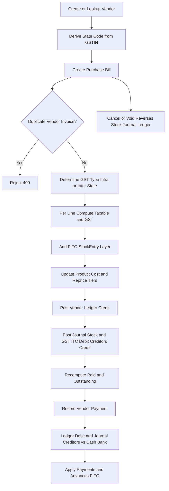

**Triggers / feeds:** Writes FIFO `StockEntry`/`WarehouseStock` consumed by Billing/Inventory;
posts `JournalEntry`/`JournalLine` (STOCK, GST_ITC, CREDITORS, CASH/BANK) to Accounting; updates
`Product.purchase_cost` and `ProductCostHistory` feeding Products/Reports; calls Cleartax GSTIN
lookup for vendor onboarding.

---

## 5. Warehouse

**What it does:** Manages warehouses and their stock movements. Users create/obsolete/delete
warehouses (guarded by reference checks), then run four stock operations: **DC-linked transfers**
(deduct source on create, add destination on DC confirm, restore source on reject), **adjustments**
(in/out via FIFO), **write-offs** (pending → approved, consuming FIFO and posting a loss journal),
and **opening stock** (seeds `StockEntry` plus ledger/account openings). Each operation drives
`WarehouseStock` and `StockEntry`; write-offs and openings also touch the accounting ledger.

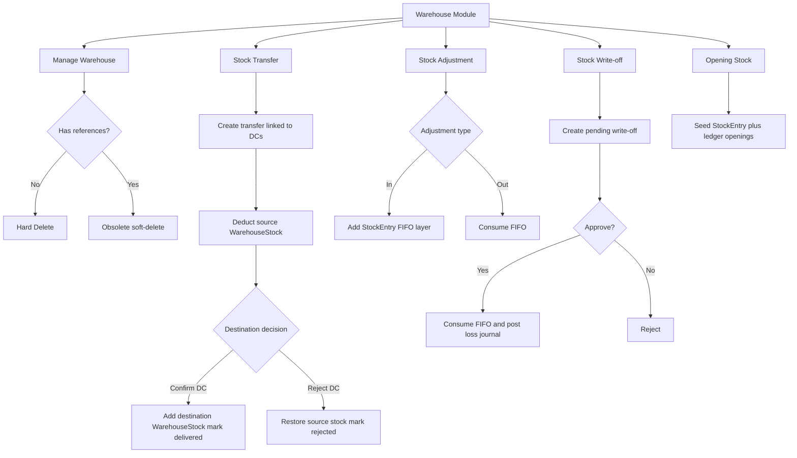

**Triggers / feeds:** Reads Delivery Challans/Invoices from Billing to drive transfers; consumes
Product FIFO via `StockService`; write-off approval and opening balances post to Accounting
`journal_entries`/`journal_lines`, customer/vendor `LedgerEntry`, and Account opening balances.
No GST/E-Invoice calls.

---

## 6. Billing & Sales

**What it does:** Manages customers (credit limits, GSTIN lookup, addresses, running
ledger/outstanding) and creates sales documents (B2B/B2C invoices, quotations, delivery challans,
credit notes). On invoice creation it validates stock and credit limit, determines GST type from
warehouse vs shipping state, consumes stock FIFO to capture COGS cost, posts a customer ledger
debit and a double-entry journal (DR Debtors, CR Sales, CR GST Payable), then records receipts
that pay invoices oldest-first (FIFO) with a CASH/BANK debit and Debtors credit.

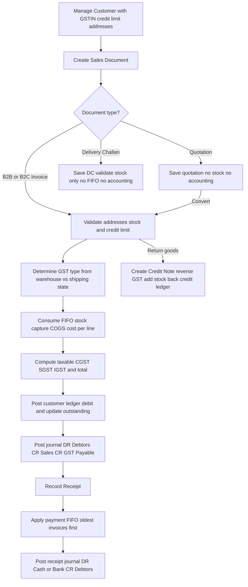

**Triggers / feeds:** Writes/consumes `StockEntry` FIFO layers via `StockService` for stock
movement and COGS cost; posts `journal_entries`/`journal_lines` against the chart of accounts;
produces CGST/SGST/IGST output liability and invoice records feeding GST/E-Invoice and Reports;
receipts touch CASH/BANK (Banking).

---

## 7. Accounting

**What it does:** Double-entry bookkeeping and treasury: a cheque register with
received→deposited→cleared/bounced lifecycle (bounce reverses the customer ledger), daily cash
closing reconciled from cash receipts minus approved cash expenses, expense capture with
threshold-based admin approval (posts DR Expenses / CR Cash-or-Bank), TDS recording and Form 26AS
reconciliation, customer receivables ageing with collection-priority scoring, vendor payment-due
alerts, and read-only journal listing plus trial balance against the chart of accounts.

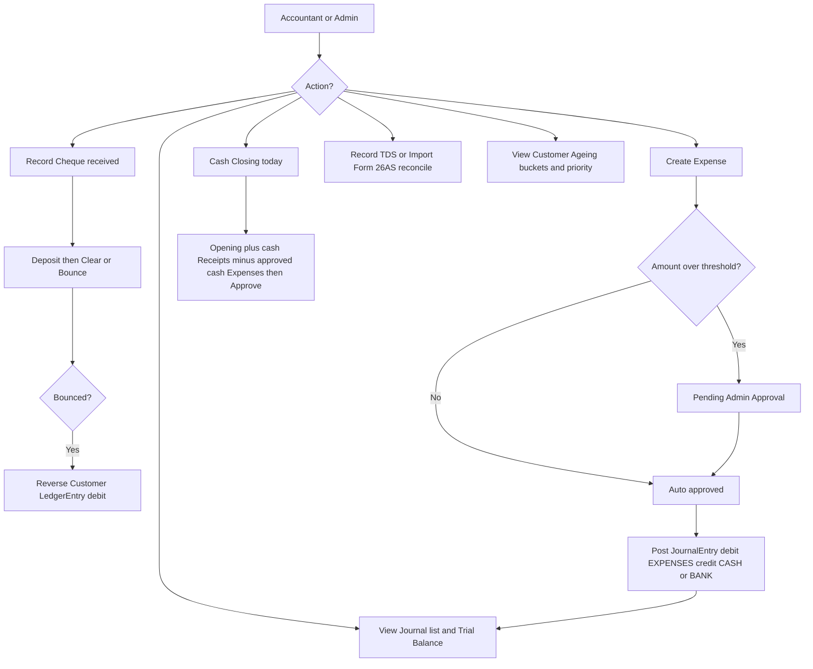

**Triggers / feeds:** Reads `CustomerPayment` receipts and invoice outstanding from Billing (cash
closing, ageing, ledger reversal) and `payment_due_date` from Purchase (vendor due alerts); writes
`JournalEntry`/`JournalLine` and Account postings consumed by Reports' trial balance; writes
reversing `LedgerEntry` rows back to the customer ledger on cheque bounce.

---

## 8. GST / E-Invoice / E-Way Bill

**What it does:** Integrates with Cleartax for statutory compliance. **E-Invoice:** generates an
IRN + signed QR + acknowledgement for a sales invoice — calling the real API with retries, or
returning a deterministic mock when `CLEARTAX_SANDBOX` is on and no auth token is set — then
persists IRN/QR/Ack on the invoice; cancellation is allowed only within 24 hours. **E-Way Bill:**
generated against an invoice with transporter/vehicle/distance. **Returns:** GSTR-1 is built from
outward invoices for a period, GSTR-2B reconciles imported supplier data against recorded
purchases, and GSTR-3B produces the summary. Transporter and vehicle masters support e-way logistics.

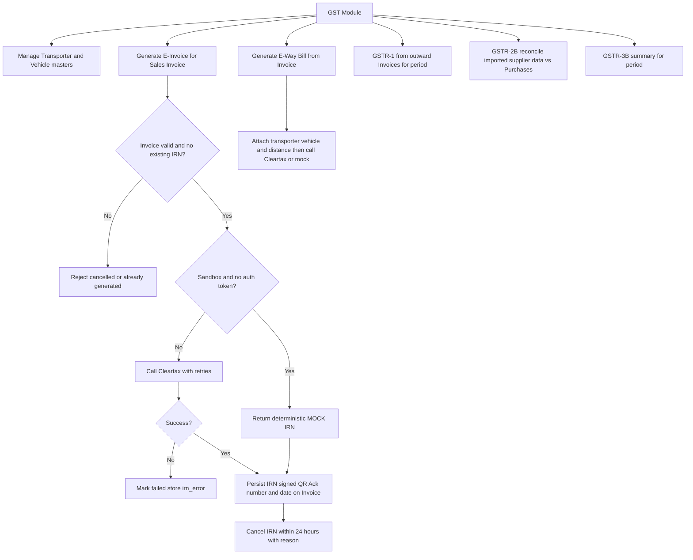

**Triggers / feeds:** Reads Billing invoices (and their GST breakup) to push IRN/E-Way and to
build GSTR-1; reads Purchase records to reconcile GSTR-2B; writes IRN/QR/Ack and e-way fields back
onto the invoice. Uses Settings GSTIN/state/`eway_threshold`. External calls go to Cleartax
(mocked in sandbox).

---

## 9. Banking

**What it does:** Bank-facing financial reporting and reconciliation. The core flow generates a
**Bank Stock Statement** (drawing-power certificate) by valuing FIFO stock from `StockEntry` and
summing outstanding debtors from open invoices, then derives drawing power against a CC limit and
locks the statement. A separate flow **imports bank statement lines** and auto-matches them
against accounting `LedgerEntry` rows by amount and date to produce matched/unmatched buckets plus
a closing-balance difference. It also manages email-notification settings, scheduled-report
config, and backup status.

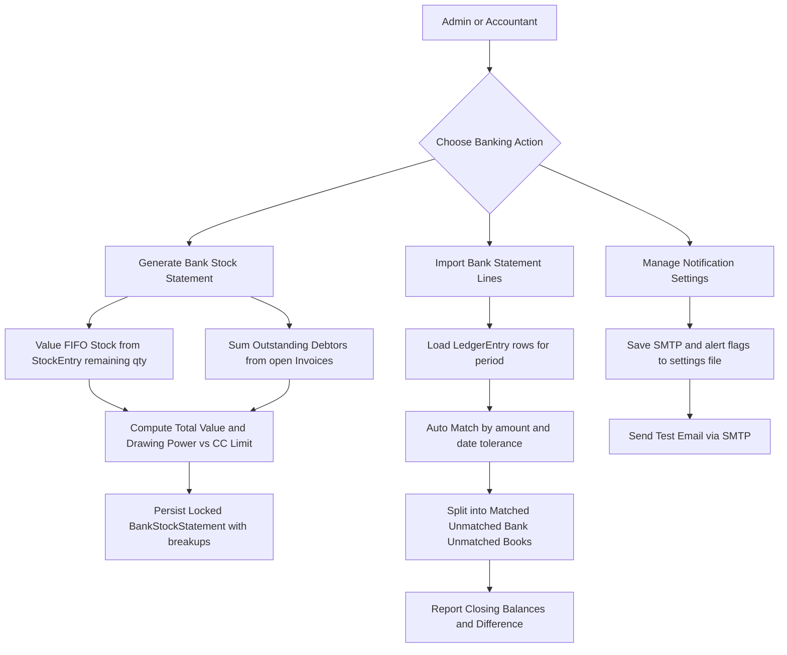

**Triggers / feeds:** Reads Inventory `StockEntry` FIFO costs and Billing invoice outstanding for
valuation; reconciles against Accounting `LedgerEntry` postings; emits SMTP notifications and
exposes scheduled-report and backup status. Read-only across modules.

---

## 10. Reports & Dashboard

**What it does:** Read-only aggregation layer. Thin routers delegate to service classes that
aggregate already-posted data from across the ERP. The dashboard runs each metric in isolation
(rolling back on failure so one bad metric degrades gracefully) to return sales, receivables,
payables, FIFO stock value, low-stock counts, cash balance and trends. Separate report services
produce sales, purchase, stock valuation, P&L, day-book and customer/vendor ledger views over
chosen date ranges and financial year.

```mermaid
flowchart TD
    U[User requests report or dashboard] --> R[Reports and Dashboard routers]
    R --> Q{Which view}
    Q -->|Dashboard| D[DashboardService get_metrics per FY]
    D --> SAFE[Run each metric isolated rollback on error]
    SAFE --> AGG[Sales receivables payables stock value low stock cash trend]
    Q -->|Sales report| SR[Aggregate Invoices by date and customer]
    Q -->|Purchase report| PR[Aggregate Purchases by date and vendor]
    Q -->|Stock report| ST[Sum WarehouseStock with FIFO StockEntry value]
    Q -->|P and L| PL[Revenue minus FIFO COGS minus approved Expenses]
    Q -->|Day book| DB[Combine sales purchases receipts expenses for a day]
    Q -->|Ledger| LG[Customer or Vendor LedgerEntry running balance]
    AGG --> OUT[JSON metrics and rows to UI]
    SR --> OUT
    PR --> OUT
    ST --> OUT
    PL --> OUT
    DB --> OUT
    LG --> OUT
```

**Triggers / feeds:** Read-only consumer with no side effects — aggregates Billing invoices and
`InvoiceItem.fifo_cost`, Purchase records, `WarehouseStock`/`StockEntry` FIFO layers,
Accounting expenses/cash-closing, `LedgerEntry`, and vendor outstanding. Posts no journals, makes
no stock movements, triggers no GST calls.
